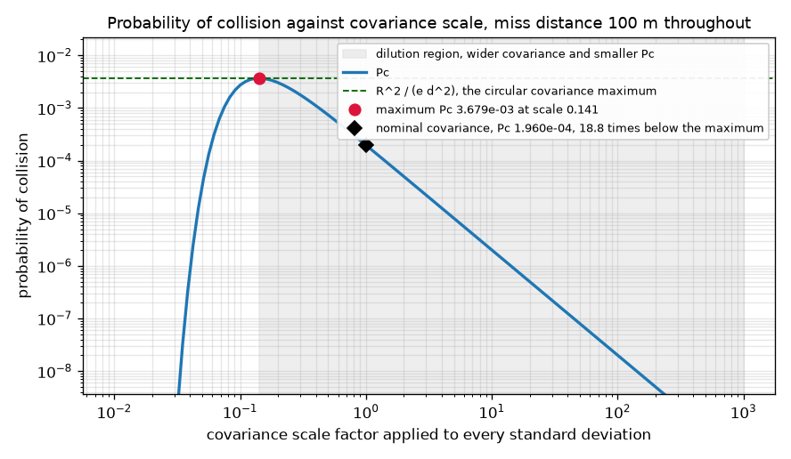
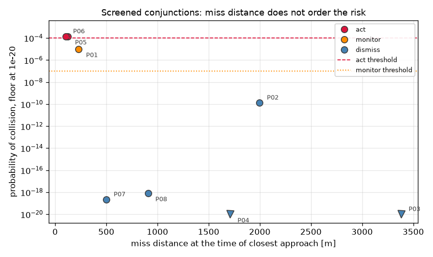

# Conjunction Screening

Filtering a catalogue down to the conjunctions that can matter, and computing the probability
of collision for each of them by two independent formulations that check each other.

[](https://github.com/Eelis03/conjunction-screening/actions/workflows/ci.yml)
[](https://www.python.org/downloads/)
[](LICENSE)



## Dilution: a larger covariance can report a smaller probability

The figure above is one encounter, swept over five decades of covariance scale. The miss
distance is 100 m at every point on that curve, the combined hard body radius is 10 m at
every point, and nothing moves except the size of the uncertainty. The probability rises,
peaks at 3.678810e-03, and then falls away with a fitted log slope of -2.0000, which is the
inverse square asymptote the small radius analysis predicts.

Read the falling branch again, because it is the part that gets misused. At a covariance
scale of 8.2540 the reported probability is 2.934733e-06. That is 66.79 times smaller than
the 1.960205e-04 reported at the nominal covariance, and the two objects are exactly as far
apart in both cases. The probability fell because the uncertainty grew.

A screening system that treats a small probability as evidence of safety will therefore
dismiss most confidently the objects it understands least. Distinguishing the two cases needs
a second number, and this library reports it: the maximum probability reachable by scaling
the covariance, and the ratio of that maximum to the reported value. Here the nominal
covariance sits 18.77 times below its own peak. A dilution factor near one is evidence of
safety. A large one is evidence that the object needs more tracking, not less attention.

The peak itself is checkable. Alfano's closed form for a circular covariance gives
`R^2 / (e d^2)` = 3.678794e-03 at a standard deviation of `d / sqrt(2)` = 70.7 m. The
numerical search finds 3.678810e-03 at 70.5 m, agreeing to 4.3e-6 relative on the value and
to 0.3 percent on the location.

## Installation

Requires Python 3.12 or later.

```bash
git clone https://github.com/Eelis03/conjunction-screening.git
cd conjunction-screening
uv sync --all-extras --dev
```

Using pip instead of uv:

```bash
python -m venv .venv
.venv/bin/activate      # Windows: .venv\Scripts\activate
pip install -e ".[dev]"
```

## From a catalogue to a probability

Screening one primary against a catalogue means examining every pair, and a full close
approach search over a day of orbital motion is far too expensive to run on all of them. The
cascade of Hoots, Crawford, and Roehrich (1984) is applied in the published order, which is
also cheapest first. The perigee and apogee filter compares the radial shells the two orbits
occupy; it is exact, by the reverse triangle inequality. The orbit path filter bounds the
minimum distance between the two paths treated as static curves, using a Lipschitz branch and
bound whose constant has a closed form, so a sampled separation becomes a rigorous lower
bound over a whole cell of anomaly space. The time filter maps the arcs that could produce a
close approach into time intervals through Kepler's equation and rejects a pair whose
intervals never coincide.

A filter that discards a real conjunction is worse than no filter at all, so each rejection
is backed by an inequality that holds for every true anomaly and every time in the window,
never by a sampled minimum. Both budgets that can stop the branch and bound early return a
pass, so exhausting a budget costs selectivity and never safety.

What survives is refined to a time of closest approach with Brent's method applied to the
product of the relative position and the relative velocity, which vanishes at every extremum
of the range and stays smooth through it. Both covariances are then carried from the RIC
frame at the catalogue epoch into the inertial frame, forward with the state transition
matrix of the two-body flow, and into the plane normal to the relative velocity. That last
projection is what makes a two-dimensional formulation valid: under linear relative motion
the secondary crosses that plane in a straight line, so the three-dimensional question
becomes a two-dimensional one about a region.

The probability is the mass of a bivariate Gaussian inside that region, and it is evaluated three
independent ways. Foster and Estes (1992) integrate in polar coordinates with adaptive quadrature.
Alfano (2005a) performs the inner integral analytically with the error function and applies
Simpson's rule to what is left. Patera (2001) applies Green's theorem and integrates around the
boundary of the region instead of over its interior, so the region enters only as the curve that
bounds it and an ellipse costs a different curve rather than a different derivation. The three
share nothing but the reduction to principal axes, so agreement between them checks all three.
Chan's series (2008) and a Monte Carlo estimator that samples the three-dimensional relative
position provide two further checks of a different kind.

```python
from conjunction_screening import generate_catalog, run_screening
from conjunction_screening.analysis.ranking import format_ranking_table, rank_report
from conjunction_screening.pipeline.screening import ScreeningConfig

catalog = generate_catalog(count=240, planted=8, window_s=86_400.0, seed=20260731)
report = run_screening(catalog, ScreeningConfig.for_threshold(5_000.0))

print(report.rejection_counts)
# {'orbit-path': 28, 'perigee-apogee': 201, 'time': 3}

print(format_ranking_table(rank_report(report), limit=3))
# rank  object               tca [s]    miss [m]  v_rel [m/s]  radius [m]           Pc  action
# ----------------------------------------------------------------------------------------------
#    1  PLANTED-05         12353.126       122.5        744.2         6.7   1.4379e-04  act
#    2  PLANTED-06         67252.006       103.5       1670.4         7.8   1.3852e-04  act
#    3  PLANTED-01         57650.359       230.7       2644.7         7.3   1.0201e-05  monitor
# ... 5 further event(s) not shown
```

Four runnable scripts live in `examples/`, each with `--help` and a `--reduced` flag:

```bash
uv run python examples/screen_catalog.py
uv run python examples/dilution_study.py
uv run python examples/method_comparison.py
uv run python examples/render_figures.py
```

## Results

Every number here was produced by the commands shown, on a synthetic catalogue generated from
seed 20260731. No orbital element set is downloaded or embedded.

### The cascade earns its cost

`uv run python examples/screen_catalog.py`, 240 secondary objects, an 86400 s window, and a
5000 m screening threshold.

| Stage | Rejected | Remaining |
| --- | --- | --- |
| perigee and apogee filter | 201 | 39 |
| orbit path filter | 28 | 11 |
| time filter | 3 | 8 |

The eight survivors produced eight conjunction events. The time filter narrowed the close
approach search to 2792.1 s of candidate windows, against the 691200 s that searching the
whole window for all eight survivors would have covered, a reduction by a factor of 247.6.

### Miss distance does not order the risk



| Rank | Object | TCA [s] | Miss [m] | Relative speed [m/s] | Combined radius [m] | Pc | Action |
| --- | --- | --- | --- | --- | --- | --- | --- |
| 1 | PLANTED-05 | 12353.126 | 122.5 | 744.2 | 6.7 | 1.4379e-04 | act |
| 2 | PLANTED-06 | 67252.006 | 103.5 | 1670.4 | 7.8 | 1.3852e-04 | act |
| 3 | PLANTED-01 | 57650.359 | 230.7 | 2644.7 | 7.3 | 1.0201e-05 | monitor |
| 4 | PLANTED-02 | 21248.427 | 1997.8 | 471.0 | 6.8 | 1.3181e-10 | dismiss |
| 5 | PLANTED-08 | 73496.495 | 907.9 | 786.3 | 5.8 | 8.3734e-19 | dismiss |
| 6 | PLANTED-07 | 32526.929 | 500.9 | 4576.0 | 5.6 | 2.1838e-19 | dismiss |
| 7 | PLANTED-04 | 66519.202 | 1710.7 | 2938.4 | 7.4 | 4.5812e-224 | dismiss |
| 8 | PLANTED-03 | 53295.102 | 3382.9 | 572.3 | 6.4 | 0.0000e+00 | dismiss |

The action thresholds are 1e-4 for act and 1e-7 for monitor. Both markers below the floor of
the figure are events whose probability underflowed or reached zero.

Ranks 1 and 2 invert the miss distance order at the top of the table, and ranks 5 and 6 invert
it again at the bottom. The same command prints the reason:

| Object | Miss [m] | sigma x [m] | sigma y [m] | Miss in sigma | Pc |
| --- | --- | --- | --- | --- | --- |
| PLANTED-05 | 122.5 | 1554.5 | 84.2 | 0.61 | 1.4379e-04 |
| PLANTED-06 | 103.5 | 3139.2 | 70.4 | 0.04 | 1.3852e-04 |
| PLANTED-01 | 230.7 | 1964.3 | 94.7 | 2.30 | 1.0201e-05 |
| PLANTED-02 | 1997.8 | 2128.9 | 352.6 | 4.97 | 1.3181e-10 |
| PLANTED-08 | 907.9 | 5248.5 | 87.4 | 7.93 | 8.3734e-19 |
| PLANTED-07 | 500.9 | 1582.0 | 29.4 | 8.40 | 2.1838e-19 |
| PLANTED-04 | 1710.7 | 2788.1 | 38.6 | 31.91 | 4.5812e-224 |
| PLANTED-03 | 3382.9 | 4449.0 | 35.8 | 87.79 | 0.0000e+00 |

Rank 6 is 407 m closer than rank 5 and still carries the smaller probability, because in the
units the probability is computed in it is the more distant of the two: 8.40 standard
deviations against 7.93, its combined covariance being three times tighter across the miss
direction, 29.4 m against 87.4 m. The metres and the risk disagree because they are measuring
different things, and this inversion is pinned by a regression test.

### Foster against Alfano, Chan, and four million samples

`uv run python examples/method_comparison.py`, eight encounters spanning miss distances from
50 m to 700 m and in-plane covariance aspect ratios from 1 to 20.


| Case | Miss [m] | R [m] | sigma x [m] | sigma y [m] | Foster | Alfano | Chan |
| --- | --- | --- | --- | --- | --- | --- | --- |
| circular-near | 50.0 | 10.0 | 100.0 | 100.0 | 4.402846e-03 | 4.402846e-03 | 4.402846e-03 |
| circular-mid | 200.0 | 12.0 | 250.0 | 250.0 | 8.361961e-04 | 8.361961e-04 | 8.361961e-04 |
| circular-far | 700.0 | 8.0 | 300.0 | 300.0 | 2.337730e-05 | 2.337730e-05 | 2.337730e-05 |
| elongated-2to1 | 150.0 | 10.0 | 400.0 | 200.0 | 5.823430e-04 | 5.823430e-04 | 5.823948e-04 |
| elongated-5to1 | 300.0 | 12.0 | 1000.0 | 200.0 | 2.626679e-04 | 2.626679e-04 | 2.626916e-04 |
| elongated-20to1 | 200.0 | 15.0 | 2000.0 | 100.0 | 1.260562e-04 | 1.260562e-04 | 1.253716e-04 |
| wide-covariance | 120.0 | 10.0 | 3000.0 | 1500.0 | 1.110036e-05 | 1.110036e-05 | 1.110038e-05 |
| tight-covariance | 80.0 | 9.0 | 60.0 | 40.0 | 4.004085e-03 | 4.004085e-03 | 3.995193e-03 |

The worst relative difference between Foster and Alfano over the eight cases is 4.348e-16,
which is the level of the double precision representation and well inside the 1e-11 relative
tolerance each quadrature was asked for. Two formulations that share only the principal axis
reduction landing on the same double is the strongest evidence available here.

The worst relative difference between Foster and Chan is 5.431e-03, on the tight-covariance
case. Chan agrees with Foster to 5.910e-16 on the three circular cases, where its equal-area
substitution is an identity, and departs as the aspect ratio grows. That is the expected
behaviour of the approximation, and it is why Chan is a cross check here rather than the
primary result.

The Monte Carlo estimator, 4000000 draws per case, samples the three-dimensional relative
position, projects each draw onto the plane normal to the relative velocity, and counts the
draws inside the hard body radius, so it tests the encounter plane construction as well as
the integral.

| Case | Foster | Monte Carlo | Standard error | Deviation |
| --- | --- | --- | --- | --- |
| circular-near | 4.402846e-03 | 4.408250e-03 | 3.312e-05 | 0.16 sigma |
| circular-mid | 8.361961e-04 | 8.352500e-04 | 1.444e-05 | 0.07 sigma |
| circular-far | 2.337730e-05 | 1.950000e-05 | 2.208e-06 | 1.76 sigma |
| elongated-2to1 | 5.823430e-04 | 5.890000e-04 | 1.213e-05 | 0.55 sigma |
| elongated-5to1 | 2.626679e-04 | 2.657500e-04 | 8.150e-06 | 0.38 sigma |
| elongated-20to1 | 1.260562e-04 | 1.360000e-04 | 5.831e-06 | 1.71 sigma |
| wide-covariance | 1.110036e-05 | 9.500000e-06 | 1.541e-06 | 1.04 sigma |
| tight-covariance | 4.004085e-03 | 4.030250e-03 | 3.168e-05 | 0.83 sigma |

Every case lies within 1.76 binomial standard errors of the analytic value. The standard
error is computed from the estimate itself, so the check tightens as the sample count grows
rather than being calibrated to the difference that happened to be observed.

### The dilution sweep, in numbers

`uv run python examples/dilution_study.py`. The isotropic reference case is the one drawn at
the top of this page: miss distance 100 m, nominal sigma 500 m in both in-plane directions,
combined hard body radius 10 m.

| Quantity | Value |
| --- | --- |
| Pc at the nominal covariance | 1.960205e-04 |
| maximum Pc found numerically | 3.678810e-03 at a covariance scale of 0.1411 |
| geometric mean sigma at the maximum | 70.5 m |
| closed form R^2 / (e d^2) | 3.678794e-03 |
| closed form d / sqrt(2) | 70.7 m |
| dilution factor, maximum divided by nominal | 18.77 |
| fitted slope of log Pc against log scale, largest decade | -2.0000 |

| Covariance scale | Pc |
| --- | --- |
| 0.0100 | 2.756176e-73 |
| 0.0681 | 6.210928e-04 |
| 0.1778 | 3.356238e-03 |
| 0.4642 | 8.456633e-04 |
| 1.2115 | 1.344053e-04 |
| 8.2540 | 2.934733e-06 |
| 56.2341 | 6.324515e-08 |
| 1000.0000 | 2.000000e-10 |

The same command repeats the sweep on real pipeline output. PLANTED-05, the highest ranked
event of the screening run, has a nominal in-plane covariance of 1554.5 m by 84.2 m, a miss
distance of 122.5 m, and a probability of 1.437928e-04. Scaling that covariance reaches a
maximum of 3.458534e-04 at a scale of 0.4272, a dilution factor of 2.41, so the nominal
covariance already sits past the peak. The closed form value of 1.111049e-03 for that
geometry is higher than the achievable maximum, because it applies to a circular covariance
and inflating an elongated one isotropically explores a different family.

## Figures

The three figures on this page are committed snapshots, not build artefacts. One command
rewrites all three:

```bash
uv run python examples/render_figures.py
```

They are regenerated from the same seeds and the same settings that produce the tables above,
so a figure and the table beside it describe one run. Continuous integration does not compare
them byte for byte, because matplotlib output is not byte reproducible across platforms or
across its own patch releases; a byte comparison would fail on a font rendering difference
and say nothing about the mathematics. What is checked is that every tracked figure is a real
PNG, that they fit inside a 250 KB budget, and that each one is referenced by this file.

## Verification

```bash
uv run pytest --cov=src/conjunction_screening --cov-report=term-missing
uv run ruff check .
uv run mypy
```

222 tests cover 95.90 percent of the 1754 statements in the package. Continuous integration
runs that same command with `--cov-fail-under=93` on Ubuntu and on Windows, which is the
measured figure rounded down and given two points of headroom, so that a platform difference
in which branch a filter takes cannot fail a build on its own.

The suite has three tiers: property and invariant tests over the mathematics, regression tests
pinning one recorded screening run, and integration tests that run every example script under
a reduced iteration count.

The safety property the whole cascade rests on is covered directly. Catalogues in which every
secondary is a planted conjunction with a known time of closest approach and a known miss
distance are generated, and every filter is required to pass every one of them. Selectivity is
covered separately, on pairs whose geometry can be checked on paper: two circular orbits
800 km apart, a circle and a perpendicular ellipse whose paths stay 17.5 km apart, and two
equal-period circles crossing a quarter of a revolution out of phase. The Lipschitz constant
the orbit path filter depends on is checked against a finely sampled numerical derivative,
because a filter whose bound is not a bound could discard a real conjunction.

Other invariants covered: the state transition matrix is symplectic; the time of closest approach
has zero relative range rate; miss distance is symmetric under swapping the two objects; the
encounter plane projection preserves the magnitude of a perpendicular relative position; the
covariance stays symmetric and positive semi-definite through every stage; Foster, Alfano, and
Patera agree on a disc, and Foster and Patera still agree on an outline that is not one; Chan is
exact for a circular covariance and departs monotonically as the aspect ratio grows; the combined
hard body contains the Minkowski sum of the two bodies in every direction; the dilution curve
rises then falls; and a Monte Carlo estimate agrees with every analytic value.

Two rules govern the tolerances. Only values from a converged solve are pinned, and the
regression module asserts that every pinned event converged, because the state of a
non-converged iteration depends on the order a floating point reduction ran in and differs
between machines. Every tolerance is derived from the measurement rather than from an observed
error: the residual range rate is bounded by the curvature of the range times the root find
tolerance, the symplectic residual by the square of the largest entry of the non-dimensional
transition matrix, the Monte Carlo comparison by four binomial standard errors computed from
the estimate. Probabilities below the dismissal threshold are pinned to two significant figures
rather than six, because a value twelve orders below dismissal is a deep tail quadrature that
no machine reproduces to parts per million, and a real regression there moves it by orders of
magnitude rather than by parts per million.

## What this does not do

`docs/design-notes.md` carries the full list, the alternatives that were considered and
rejected, and what closing each limitation would cost. The short version:

- The propagation is two-body. There is no J2, no drag, no third body, no solar radiation
  pressure. The synthetic catalogue is generated under the same model, so the internal
  consistency the tests check is real, but no number here is a prediction about a real object.
  Adding J2 secular rates would force the path and time filters to be padded by roughly 500 km
  for a one day window, which destroys the selectivity that makes the cascade worth running.
- The two-dimensional formulation assumes a short encounter with linear relative motion and a
  covariance that does not evolve during it. It fails for slow encounters and for repeating
  ones, and nothing here detects either condition.
- The covariances are synthetic, and the two objects are treated as having uncorrelated orbit
  determination errors.
- Probability of collision is a decision input and not a decision. It says nothing about the
  cost of a manoeuvre, the propellant budget, or the risk of moving into a different part of
  the catalogue.

The hard body used to be on that list, and is not any more. Both objects were once treated as
spheres with a single combined radius, which is poor for a large object with deployed
structures, where the cross section depends on the direction of approach. An object can now be
given a triaxial ellipsoid; the two bodies are combined into one that provably contains their
Minkowski sum, and its shadow along the relative velocity is the region the probability is
integrated over. The 25 m by 5 m body in the test suite presents a cross section five times
larger in area seen side on than seen end on, and the screening report gives every event its
own outline. `docs/design-notes.md` records what that cost.

## References

Methods:

- Hoots, F. R., Crawford, L. L., and Roehrich, R. L. "An Analytic Method to Determine Future
  Close Approaches Between Satellites." Celestial Mechanics, Vol. 33, No. 2, 1984,
  pp. 143 to 158. DOI [10.1007/BF01234152](https://doi.org/10.1007/BF01234152). Source of
  the three-filter cascade and of its application order.
- Foster, J. L., and Estes, H. S. "A Parametric Analysis of Orbital Debris Collision
  Probability and Maneuver Rate for Space Vehicles." NASA JSC-25898, NASA Lyndon B. Johnson
  Space Center, August 1992. Stable record:
  [Stanford SearchWorks 13354320](https://searchworks.stanford.edu/view/13354320). Source of
  the polar quadrature formulation of the two-dimensional probability of collision.
- Patera, R. P. "General Method for Calculating Satellite Collision Probability." Journal of
  Guidance, Control, and Dynamics, Vol. 24, No. 4, 2001, pp. 716 to 722.
  DOI [10.2514/2.4771](https://doi.org/10.2514/2.4771). Source of the reduction of the area
  integral to a contour integral around the boundary of the hard body outline, which is the
  analytic method that does not assume the outline is a circle.
- Alfano, S. "A Numerical Implementation of Spherical Object Collision Probability." The
  Journal of the Astronautical Sciences, Vol. 53, No. 1, 2005, pp. 103 to 109.
  DOI [10.1007/BF03546397](https://doi.org/10.1007/BF03546397). Source of the reduction of
  the disc integral to a single integral of error functions evaluated by Simpson's rule.
- Alfano, S. "Relating Position Uncertainty to Maximum Conjunction Probability." The Journal
  of the Astronautical Sciences, Vol. 53, No. 2, 2005, pp. 193 to 205.
  DOI [10.1007/BF03546350](https://doi.org/10.1007/BF03546350). Source of the maximum
  probability over covariance scaling and of the closed form used as its reference.
- Chan, F. K. "Spacecraft Collision Probability." The Aerospace Press and the American
  Institute of Aeronautics and Astronautics, 2008. ISBN 978-1-884989-18-6.
  DOI [10.2514/4.989186](https://doi.org/10.2514/4.989186). Source of the convergent series
  and of the equal-area circle substitution it rests on.
- Kurzhanski, A. B., and Valyi, I. "Ellipsoidal Calculus for Estimation and Control."
  Systems and Control: Foundations and Applications, Birkhauser, 1997.
  ISBN 978-0-8176-3699-9. Publisher record:
  [Springer 9780817636999](https://link.springer.com/book/9780817636999). Source of the
  external ellipsoidal approximation of a Minkowski sum, used here to combine two hard
  bodies into one.

Dependencies:

- [numpy](https://numpy.org/) 2.0 or later. Array arithmetic, symmetric eigendecomposition,
  and the seeded random number generator used by the catalogue and the Monte Carlo
  estimator. BSD 3-Clause licence.
- [scipy](https://scipy.org/) 1.14 or later. Adaptive two-dimensional quadrature for the
  Foster method, Brent root finding for the time of closest approach, bounded scalar
  minimisation for the maximum probability, and the error and log gamma functions.
  BSD 3-Clause licence.
- [matplotlib](https://matplotlib.org/) 3.9 or later. Figure generation in the analysis
  layer. Matplotlib licence, a BSD-compatible licence derived from the Python Software
  Foundation licence.
- [pytest](https://docs.pytest.org/) 8.3 or later, development only. Test runner.
  MIT licence.
- [pytest-cov](https://pytest-cov.readthedocs.io/) 6.0 or later, development only. Coverage
  measurement. MIT licence.
- [ruff](https://docs.astral.sh/ruff/) 0.8 or later, development only. Linter and import
  sorter. MIT licence.
- [mypy](https://mypy-lang.org/) 1.13 or later, development only. Static type checker.
  MIT licence.

## License

Released under the MIT license. See [LICENSE](LICENSE).
